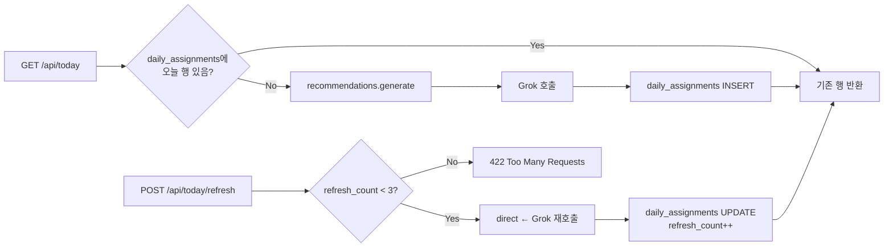

# Grok 일일 WOD 추천 — 입력 컨텍스트 + 프롬프트 초안

## 0. 사용 모델

- 모델: `grok-4-1-fast-non-reasoning` (환경변수 `XAI_MODEL`로 오버라이드).
- 호출 패턴: [backend/routes/burnfat_ai.py](../backend/routes/burnfat_ai.py)의 `_call_grok` 헬퍼 그대로 차용 (OpenAI 호환 chat/completions, Bearer token).
- 비용 통제: `(user_id, date)` 단위 캐싱 — 동일 날짜 재호출 시 `daily_assignments` 행을 그대로 반환. `POST /api/today/refresh`만 추가 호출 발생, 일 3회 제한.

## 1. 입력 컨텍스트 스키마

서버는 다음 객체를 **JSON 직렬화** 후 system + user 메시지로 분할해 전달한다.

```jsonc
{
  "user": {
    "id": 42,
    "name": "민지",
    "registered_at": "2026-04-01"
  },
  "preferences": {
    "goals": ["muscle_gain", "conditioning"],
    "equipment": ["bodyweight", "dumbbell"],
    "available_minutes": 20,
    "difficulty": "intermediate",
    "push_time": "09:00",
    "timezone": "Asia/Seoul"
  },
  "today": "2026-05-03",
  "recent_assignments": [
    {
      "date": "2026-05-02",
      "program_id": 567,
      "program_title": "Cindy Variation",
      "completed": true,
      "completion_time": 1062,
      "skipped": false,
      "user_feedback": null
    },
    {
      "date": "2026-05-01",
      "program_id": 432,
      "program_title": "Tabata Squats",
      "completed": true,
      "completion_time": 480,
      "skipped": false,
      "user_feedback": "easy"
    }
  ],
  "recent_records": [
    {
      "date": "2026-05-02",
      "program_id": 567,
      "completion_time": 1062,
      "notes": "마지막 라운드 풀업이 힘들었음"
    }
  ],
  "available_programs": [
    {
      "id": 100,
      "title": "Push Day Custom",
      "workout_type": "round_based",
      "difficulty": "intermediate",
      "expected_minutes": 18,
      "exercises": [
        { "name": "푸시업", "target_value": "15회" },
        { "name": "덤벨 프레스", "target_value": "10회" }
      ],
      "source": "user_library"
    }
    // ... 최대 30개
  ]
}
```

### 1.1 데이터 수집 쿼리 가이드

- `preferences`: `user_preferences` 테이블에서 `user_id`로 조회. 미입력 시 기본값(목표=`general_fitness`, 기구=`bodyweight`, 시간=20, 난이도=`intermediate`).
- `recent_assignments`: `daily_assignments WHERE user_id = ? AND date >= today - 7`. 직전 7일 anti-repeat 시그널.
- `recent_records`: `workout_records WHERE user_id = ? AND completed_at >= today - 30`. 페이스/볼륨 시그널.
- `available_programs`:
  - 사용자 본인이 만든 `programs` (creator_id == user_id) 모두.
  - 공개 풀에서 무작위 N개 (예: 20개) 추가 — `programs` 테이블 활용. 마켓플레이스 라우트는 deprecate되었지만 데이터는 후보로 사용 가능.
  - 직전 7일 추천된 program_id는 `available_programs`에서 제외.
  - `expected_minutes`는 `WorkoutPatterns.time_cap_per_round * total_rounds` 또는 `target_value` 파싱으로 추정.

## 2. 시스템 프롬프트 초안 (`SYSTEM_PROMPT_RECOMMEND`)

```
당신은 사용자에게 매일 1개의 운동(WOD)을 추천하는 개인 PT 코치입니다.
사용자 데이터(선호·과거 기록·직전 7일 추천 이력)와 후보 WOD 목록을 보고,
오늘 가장 적합한 WOD 하나를 골라 program_id로 지정하세요.

## 선택 원칙
1. 사용자의 `preferences.goals`와 `preferences.equipment`에 부합하는 WOD를 우선합니다.
   - equipment에 없는 기구가 메인이면 후보에서 제외.
2. `preferences.available_minutes`의 ±20% 범위에 들어오는 WOD를 우선합니다.
3. `preferences.difficulty`와 일치 또는 한 단계 차이만 허용.
4. 직전 7일에 이미 추천된 program_id는 절대 다시 고르지 마세요.
5. `recent_records`로 보아 평균 완료 시간이 목표 시간보다 짧다면 난이도를 한 단계 올리고,
   길거나 스킵이 많다면 한 단계 내리세요.
6. `user_feedback == "easy"`가 직전에 있었다면 강도를 올리고,
   `"hard"` 또는 `"skip"`이면 회복 강도(낮은 볼륨)로 추천하세요.
7. 후보가 부족하거나 모두 부적합하면 `program_id: null`로 반환하고
   `rationale`에 그 이유를 한국어 1문장으로 적으세요.

## 출력 형식 (반드시 JSON 한 줄만)
{
  "program_id": <number | null>,
  "rationale": "<한국어 1~2문장>",
  "intensity_hint": "<easy|moderate|hard>",
  "duration_estimate_minutes": <number>
}

규칙:
- 반드시 JSON 객체 하나만 출력. 마크다운/설명/코드 블록 금지.
- rationale은 사용자가 운동 직전에 읽을 톤(친근하고 실용적). 수치를 인용하면 좋음.
- intensity_hint는 사용자에게 표시되지 않더라도 다음 추천 보정용으로 기록.
```

## 3. 사용자 메시지 페이로드

```
오늘 날짜: {today}
사용자: {user.name} (id={user.id})

선호:
- 목표: {preferences.goals}
- 기구: {preferences.equipment}
- 가용 시간: {preferences.available_minutes}분
- 난이도: {preferences.difficulty}

직전 7일 추천 이력:
{recent_assignments를 한 줄씩 요약}

최근 30일 운동 기록 요약:
- 완료: {count}회, 평균 {avg_min}분
- 스킵: {skip_count}회

후보 WOD (program_id, 제목, 난이도, 예상시간, 기구):
{available_programs를 표 형식으로}

위 정보를 토대로 오늘의 추천 WOD 하나를 JSON으로 출력하세요.
```

## 4. 응답 검증 (서버 측)

```python
def parse_grok_response(text: str, candidate_ids: set[int]) -> dict:
    data = json.loads(text)
    pid = data.get("program_id")
    if pid is not None and pid not in candidate_ids:
        # 헛소리 program_id → None 으로 강등
        pid = None
    return {
        "program_id": pid,
        "rationale": (data.get("rationale") or "").strip()[:300],
        "intensity_hint": data.get("intensity_hint") or "moderate",
        "duration_estimate_minutes": int(data.get("duration_estimate_minutes") or 0),
    }
```

JSON 파싱 실패 시: 후보 중 무작위 1개로 폴백, `rationale`은 기본 문구.

## 5. 캐싱 + 재호출 흐름



## 6. 피드백 시그널 (Phase 4)

`daily_assignments`에 `feedback_json` 컬럼 추가:

```jsonc
{
  "intensity_hint": "moderate",
  "user_feedback": "easy" | "hard" | "skip" | null,
  "refresh_count": 0,
  "client_meta": { "device": "ios", "app_version": "1.0.0" }
}
```

UI에서 [건너뛰기]는 `user_feedback="skip"`, [다른 추천] 클릭은 직전 추천을 `"refused"`로 마킹 후 새로 호출.

## 7. 보안·비용 관리

- `XAI_API_KEY` 미설정 시 라우트는 503을 반환하고 워커는 발송을 건너뜀(크래시 금지).
- 일일 푸시 워커는 사용자별 1회 호출 + refresh는 최대 3회 → 1인당 최대 4회/일.
- 응답 사이즈는 `XAI_MAX_TOKENS=300`로 제한.
- 토큰 정확도 향상을 위해 후보 WOD 목록은 30개 이하로 잘라 전달.
