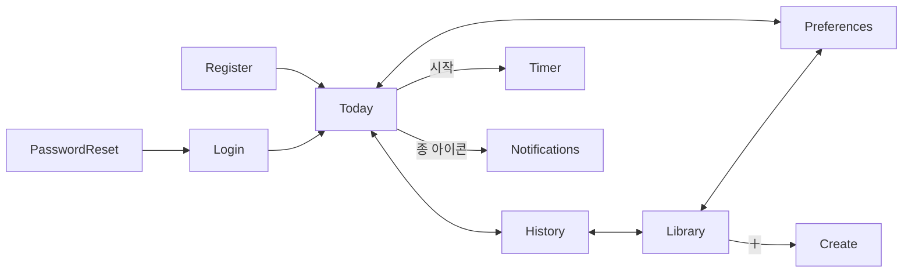

# WODYBODY 정보 구조(IA) + 텍스트 와이어프레임

## 0. 화면 분류 (총 4개 메인 + 부속)

```
[ 인증 ]
  ├─ login
  ├─ register
  └─ passwordReset

[ 메인 (인증 후, 하단 탭) ]
  ├─ today          ← 기본 랜딩
  ├─ history
  ├─ library
  └─ preferences

[ 부속 / 모달 ]
  ├─ create         (Library에서 + 버튼 → 새 WOD 만들기)
  ├─ timer          (Today/Library에서 시작 → MuiWorkoutTimer)
  └─ notifications  (헤더 종 아이콘 → MuiNotificationsPage)
```

## 1. 네비게이션 모델



상단: 로고·종 아이콘·드로어(아바타)
하단(또는 상단 탭, MuiNavigation 재활용): Today / History / Library / Preferences

## 2. 화면별 텍스트 와이어프레임

### 2.1 Today (홈, 기본 랜딩)

```
┌───────────────────────────────────────────┐
│  WODYBODY              🔔(3)         👤   │
├───────────────────────────────────────────┤
│  Today · History · Library · Preferences  │  ← 탭
├───────────────────────────────────────────┤
│                                            │
│  2026년 5월 3일 (일)                        │
│  좋은 아침이에요, 민지님!                   │
│                                            │
│  ┌─────────────────────────────────────┐  │
│  │  오늘의 WOD                          │  │
│  │  ────────────────────────            │  │
│  │  Cindy Variation                     │  │
│  │  20분 AMRAP · 중급                   │  │
│  │                                      │  │
│  │  • 풀업 5회                          │  │
│  │  • 푸시업 10회                       │  │
│  │  • 에어 스쿼트 15회                  │  │
│  │                                      │  │
│  │  💡 코치 코멘트:                      │  │
│  │  "지난 주 3회 운동 완료, 평균 18분.   │  │
│  │   오늘은 회복 강도로 라운드 수에      │  │
│  │   집중하세요."                        │  │
│  └─────────────────────────────────────┘  │
│                                            │
│  [   ▶ 시작하기   ]   [ 다른 추천(2/3) ]   │
│  [ 건너뛰기 ]                              │
│                                            │
│  최근 7일                                   │
│  ✅ 5/2  ✅ 5/1  ⏭ 4/30  ✅ 4/29 ...      │
└───────────────────────────────────────────┘
```

상태별 변화:
- **추천 미생성**: "추천 생성 중…" 스피너 + Grok 호출 후 캐시.
- **이미 완료**: 카드 상단에 ✅, [기록 보기] 버튼.
- **건너뜀**: 회색 톤 + [그래도 시작하기] 보조 버튼.
- **추천 한도 초과(refresh ≥ 3)**: [다른 추천] 비활성 + "내일 다시 시도하세요" 툴팁.
- **선호 미입력**: 추천 카드 위치에 [선호 입력하러 가기] CTA만 표시.

API:
- `GET /api/today` → `{ assignment, program, ai_rationale, refresh_count }` 또는 신규 생성.
- `POST /api/today/refresh` → 422 (한도 초과) 또는 새 assignment.
- `POST /api/today/complete` `{ completion_time, notes }` → 기록 저장.
- `POST /api/today/skip` → 스킵 마킹.

### 2.2 History

```
┌───────────────────────────────────────────┐
│  History                              ⏷ │
├───────────────────────────────────────────┤
│  ▣ 통계 카드                              │
│   - 이번 달: 15회 완료 / 총 4시간 22분      │
│   - 평균 완료 시간: 17분 33초              │
│   - 연속 운동: 4일                          │
│                                            │
│  📊 최근 30일 그래프 (완료/스킵 막대)         │
│                                            │
│  📜 기록 목록                                │
│  5/2  Cindy Variation     17:42  ★★★★    │
│  5/1  Tabata Squats        8:00  ★★★★★   │
│  4/30 (스킵)                                │
│  ...                                        │
└───────────────────────────────────────────┘
```

재사용: 기존 [MuiPersonalRecordsPage.tsx](../frontend/src/components/MuiPersonalRecordsPage.tsx)와 [MuiPersonalStatsComponent.tsx](../frontend/src/components/MuiPersonalStatsComponent.tsx)를 그대로 사용. `daily_assignments`의 skip 데이터를 추가로 표시할 수 있도록 `workout_records` 조회 응답에 합치는 백엔드 작업이 Phase 4에 포함될 수 있음(선택적).

### 2.3 Library (내 WOD)

```
┌───────────────────────────────────────────┐
│  Library                          [ ＋ ]   │
├───────────────────────────────────────────┤
│  내가 만든 WOD                              │
│                                            │
│  ┌───────────────────────────────┐         │
│  │ Push Day Custom               │   ▶ 시작│
│  │ 4 라운드 · 상급                │   ✏ 편집│
│  └───────────────────────────────┘         │
│                                            │
│  ┌───────────────────────────────┐         │
│  │ Quick 10                      │   ▶ 시작│
│  │ 10분 AMRAP · 초급             │         │
│  └───────────────────────────────┘         │
│                                            │
│  추천 풀(읽기전용)                           │
│  Grok이 제안할 수 있는 후보 30개             │
└───────────────────────────────────────────┘
```

[+] 버튼은 기존 [MuiStepBasedCreateProgramPage.tsx](../frontend/src/components/MuiStepBasedCreateProgramPage.tsx) 재사용 → page='create'.

### 2.4 Preferences

```
┌───────────────────────────────────────────┐
│  Preferences                              │
├───────────────────────────────────────────┤
│  목표                                       │
│  [ ] 체중 감량  [v] 근육 증가  [v] 컨디셔닝 │
│                                            │
│  사용 가능한 기구 (멀티 선택)                  │
│  [v] 맨몸  [v] 덤벨  [ ] 케틀벨  [ ] 바벨   │
│  [ ] 풀업바  [ ] 로잉머신                    │
│                                            │
│  하루 가용 시간                              │
│  ◯ 10분  ● 20분  ◯ 30분  ◯ 45분+           │
│                                            │
│  난이도 선호                                  │
│  ◯ 초급  ● 중급  ◯ 상급                     │
│                                            │
│  푸시 시각                                    │
│  [ 09:00 ▼ ]    Asia/Seoul                  │
│  [v] 매일 알림 받기                           │
│                                            │
│  [        저장        ]                     │
└───────────────────────────────────────────┘
```

API:
- `GET /api/me/preferences` → 현재 값 (없으면 빈 객체).
- `PUT /api/me/preferences` → 저장.
- 저장 시 푸시 토큰 등록 트리거: `POST /api/me/push-tokens` (앱 모드만).

## 3. 푸시 알림 페이로드 모델

```json
{
  "aps": {
    "alert": {
      "title": "오늘의 WOD가 도착했어요",
      "body": "Cindy Variation · 20분 AMRAP"
    },
    "sound": "default",
    "badge": 1
  },
  "wodybody": {
    "type": "daily_recommendation",
    "assignment_id": 1234,
    "program_id": 567,
    "deeplink": "wodybody://today"
  }
}
```

FCM v1: 위와 동일 의미를 `notification` + `data`로 매핑.

## 4. 모바일 셸 특화 UI 고려 사항

- **SafeArea**: `frontend/src/index.css`에 `env(safe-area-inset-*)` 적용. iPhone 노치/홈인디케이터 보호.
- **상태바**: `@capacitor/status-bar`로 라이트/다크 토글에 따라 동기화.
- **스플래시**: `@capacitor/splash-screen` — `mobile/resources/splash.png` 사용.
- **딥링크**: `wodybody://today`, `wodybody://history`, `wodybody://preferences`.
- **키보드**: `@capacitor/keyboard`로 Login/Register 입력 시 vh 조정.
- **자동 인증 유지**: JWT를 `@capacitor/preferences`에 저장 (네이티브) / `localStorage` (웹).

## 5. 페이지 enum 정의 (frontend/src/types/index.ts)

```ts
export type Page =
  | 'login' | 'register' | 'passwordReset'
  | 'today'
  | 'history'
  | 'library'
  | 'preferences'
  | 'create';
```

## 6. App.tsx 라우팅 변경 요약

```ts
useEffect(() => {
  if (user) setPage('today');   // ← 'programs' 에서 변경
  else setPage('login');
}, [user]);
```

마켓플레이스 page 분기(`'programs'`, `'my'`, `'records'`)는 모두 제거 또는 deprecate 처리. `records` → `history`, `my` → `library`.
