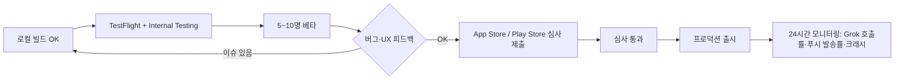

# WODYBODY 출시 체크리스트 — iOS App Store + Google Play

> 본 문서는 WODYBODY 모바일 앱(`mobile/`)을 TestFlight/Internal Testing 단계에서 프로덕션까지 진행하기 위한 단계별 체크리스트다. Burnfat은 별도 서비스이며 본 문서 대상에 포함되지 않는다.

## 0. 사전 결정 사항

- **Bundle ID / Package**: `com.wodybody.app`
- **앱 이름**: WODYBODY
- **카테고리**: 건강 및 피트니스 (Health & Fitness)
- **연령 등급**: 4+ (운동 정보, 건강 관련 일반 콘텐츠)
- **지원 언어**: 한국어(주), 영어(보조)
- **배포 채널**: App Store(iOS), Google Play(Android), 웹은 기존 Vercel 유지

## 1. Apple Developer Program (iOS)

- [ ] [Apple Developer Program 가입](https://developer.apple.com/programs/) — 연 $99. 개인 또는 법인 계정. 법인일 경우 D-U-N-S 번호 필요.
- [ ] [App Store Connect](https://appstoreconnect.apple.com)에서 새 앱 등록
  - Bundle ID: `com.wodybody.app` (Identifiers에서 먼저 등록)
  - SKU: `WODYBODY-001`
  - 기본 언어: Korean
- [ ] **APNs Authentication Key (P8)** 생성
  - Certificates, Identifiers & Profiles → Keys → `+` → "Apple Push Notifications service (APNs)"
  - 다운로드한 `.p8` 파일은 **단 1회만** 다운로드 가능 — 안전 보관
  - 백엔드 환경변수에 등록할 값:
    - `APNS_KEY_P8` = .p8 파일 본문(BEGIN PRIVATE KEY ~ END PRIVATE KEY) 또는 base64
    - `APNS_KEY_ID` = 생성된 Key ID (10자)
    - `APNS_TEAM_ID` = Membership Details의 Team ID (10자)
    - `APNS_BUNDLE_ID` = `com.wodybody.app`
    - `APNS_USE_SANDBOX` = `true` (개발/TestFlight) 또는 `false` (프로덕션)
- [ ] **App ID에 Push Notifications capability 활성화**
  - Identifiers → `com.wodybody.app` 편집 → "Push Notifications" 체크 → Save
- [ ] **Provisioning Profile** 자동 생성을 Xcode에 위임 (Signing & Capabilities → Automatically manage signing)

## 2. iOS Xcode 프로젝트 셋업

```bash
cd mobile
# (이미 추가됨) npx cap add ios
cd ios/App
pod install
open App.xcworkspace
```

- [ ] Xcode → 좌측 프로젝트 → `App` 타겟
  - General → Identity → Bundle Identifier: `com.wodybody.app`
  - Signing & Capabilities → "+ Capability" → **Push Notifications**, **Background Modes** (Remote notifications 체크)
  - Info.plist에 다음 키 추가:
    - `NSCameraUsageDescription` (선택, QR/사진 사용 시)
    - `NSUserTrackingUsageDescription` (광고 식별자 사용 시 — 1차 출시는 미사용)
- [ ] 앱 아이콘 / 스플래시: `mobile/resources/icon.png`, `splash.png`로부터
  ```bash
  cd mobile
  npm install -D @capacitor/assets
  npx capacitor-assets generate --iconBackgroundColor '#1976d2' --splashBackgroundColor '#1976d2'
  npx cap sync ios
  ```
- [ ] **Build & Archive**: Xcode → Product → Archive → Distribute → App Store Connect → Upload
- [ ] **TestFlight 내부 테스터** 등록(Apple ID 이메일) → 메일 수신 후 TestFlight 앱에서 설치 테스트.

## 3. Google Play Console (Android)

- [ ] [Google Play Console 가입](https://play.google.com/console) — 1회 $25.
- [ ] 새 앱 만들기 → 앱 이름 `WODYBODY`, 기본 언어 한국어, 무료 앱.
- [ ] 패키지명: `com.wodybody.app` (Capacitor가 이미 설정).

## 4. Firebase Cloud Messaging (FCM, Android)

- [ ] [Firebase Console](https://console.firebase.google.com)에서 프로젝트 생성 (예: `wodybody-prod`)
- [ ] Android 앱 추가 — package name `com.wodybody.app`
- [ ] `google-services.json` 다운로드 → `mobile/android/app/google-services.json`에 배치
- [ ] `mobile/android/build.gradle` (project-level)에 classpath 추가:
  ```gradle
  classpath 'com.google.gms:google-services:4.4.2'
  ```
- [ ] `mobile/android/app/build.gradle` 하단:
  ```gradle
  apply plugin: 'com.google.gms.google-services'
  ```
- [ ] **Service Account JSON** 발급 (Firebase Console → 프로젝트 설정 → 서비스 계정 → 새 비공개 키 생성)
  - 백엔드 환경변수: `FCM_SERVICE_ACCOUNT_JSON` = 다운로드한 JSON 파일 본문 (또는 base64)
  - `FCM_PROJECT_ID` = Firebase 프로젝트 ID (예: `wodybody-prod`)

## 5. Android 빌드 + 서명

```bash
cd mobile
npm run build:web
npx cap copy android
npx cap open android   # Android Studio
```

- [ ] **Keystore 생성** (Android Studio → Build → Generate Signed Bundle/APK → Create new)
  - 비밀번호·alias·.keystore 파일 안전 보관 (분실 시 앱 업데이트 불가)
- [ ] `build.gradle (Module: app)`에 signingConfig 추가:
  ```gradle
  signingConfigs {
      release {
          storeFile file('../keystore/wodybody.keystore')
          storePassword System.getenv('WODYBODY_KEYSTORE_PASSWORD')
          keyAlias 'wodybody'
          keyPassword System.getenv('WODYBODY_KEY_PASSWORD')
      }
  }
  buildTypes { release { signingConfig signingConfigs.release } }
  ```
- [ ] **App Bundle (.aab) 생성**: Build → Generate Signed Bundle → Android App Bundle.
- [ ] Play Console → 내부 테스트 트랙 → .aab 업로드 → 테스터(이메일 그룹) 추가.

## 6. 백엔드 환경변수 (Railway / Production)

| 변수 | 용도 |
|---|---|
| `XAI_API_KEY` | Grok 추천 호출 |
| `XAI_MODEL` | (선택) 기본 `grok-4-1-fast-non-reasoning` |
| `APNS_KEY_P8` | iOS 푸시 P8 키 본문 |
| `APNS_KEY_ID` | iOS 푸시 Key ID |
| `APNS_TEAM_ID` | Apple Team ID |
| `APNS_BUNDLE_ID` | `com.wodybody.app` |
| `APNS_USE_SANDBOX` | `true` 또는 `false` |
| `FCM_SERVICE_ACCOUNT_JSON` | FCM v1 서비스 계정 JSON |
| `FCM_PROJECT_ID` | Firebase 프로젝트 ID |
| `MARKETPLACE_ENABLED` | `false` (PT 모델만 노출) |
| `PT_PUSH_ENABLED` | `true` (워커 활성) |
| `PT_PUSH_WORKER_ENABLED` | `true` |
| `PT_DAILY_REFRESH_LIMIT` | `3` (1인당 일 새로받기 한도) |
| `PT_CANDIDATE_POOL_LIMIT` | `30` |

배포 후 1회만 실행:

```bash
cd backend
python migrations/add_pt_tables.py
```

## 7. 스토어 메타데이터

### 7.1 공통 — 스크린샷

5장 권장 (모두 한국어 UI):

1. Today — 오늘의 WOD + AI 코멘트
2. Today — "다른 추천" 클릭 후 새 WOD
3. History — 운동 기록 + 통계
4. Library — 내가 만든 WOD 리스트 + [+] 새로 만들기
5. Preferences — 푸시 시각·기구·난이도

권장 사이즈:

| 디바이스 | 사이즈 | 출처 |
|---|---|---|
| iPhone 6.9" (15 Pro Max) | 1290×2796 | Xcode Simulator |
| iPhone 6.5" (Plus) | 1242×2688 | Apple 요구 |
| iPad 13" | 2064×2752 | Apple 요구 |
| Android Phone | 1080×1920 이상 | Play Console 권장 |
| Android Tablet (선택) | 1920×1200 | |

### 7.2 앱 설명 (한국어)

> WODYBODY는 매일 아침 AI 코치(Grok)가 당신에게 딱 맞는 오늘의 운동을 추천하고 푸시로 알려주는 개인 PT 앱입니다.
>
> ✓ 매일 09시(또는 원하는 시간)에 푸시로 도착하는 "오늘의 WOD"
> ✓ 목표·기구·가용 시간·난이도 기반 개인화
> ✓ 직전 7일간 추천 안 겹침 + 운동 기록 30일 분석으로 점점 더 맞춤
> ✓ 내장 타이머로 바로 운동 시작
> ✓ 직접 만든 WOD를 라이브러리에 저장
> ✓ 마음에 안 들면 [다른 추천] 한 번 더 (일 3회 한도)

### 7.3 키워드 (App Store)

`크로스핏, WOD, 홈트, AI, 개인PT, 운동, 피트니스, 헬스, 체력, 워크아웃`

### 7.4 개인정보처리방침

- 호스팅 위치(권장): `https://wodybody-web.vercel.app/privacy` 또는 별도 GitHub Pages.
- 양식 참고: `burnfat/docs/`의 기존 양식 (Burnfat 프로젝트). 본 앱용으로 다음 항목 명시:
  - 수집 정보: 이메일·이름(가입), 운동 기록, 푸시 토큰, 디바이스 정보(앱 버전·플랫폼)
  - AI(Grok) 처리: 추천 생성 시 사용자 운동 기록 일부가 xAI에 전송됨
  - 보유 기간: 회원 탈퇴 시 30일 내 파기
  - 제3자 제공: 없음 (Grok·APNs·FCM은 처리 위탁)

## 8. 출시 단계 흐름



## 9. 사용자 동작 검증 시나리오

테스터에게 검증을 요청할 핵심 흐름:

1. 가입 → 이메일 인증 → 로그인.
2. 처음 로그인 시 **Today**가 기본 화면이고 추천 카드가 보이는가?
3. **Preferences**에서 목표·기구·시간·푸시 시각 저장 → 다시 Today로 돌아오면 추천이 바뀌는가?
4. 푸시 권한 허용 → 토큰이 백엔드에 등록되는가? (`/api/me/push-tokens GET`로 확인)
5. **다른 추천** 3회 호출 후 4회째에 한도 초과 안내가 나오는가?
6. **시작하기** → 타이머 → 완료 → History에 기록이 추가되는가?
7. **건너뛰기** → 다음 날 추천이 회복 강도(`intensity_hint=easy`)로 변하는가?
8. 백그라운드에 있는 동안 푸시 도착 → 푸시 탭 → Today 화면으로 자동 이동.
9. 앱 종료 후 재실행 시 자동 로그인 유지 (JWT가 localStorage/Capacitor Preferences에 보관).

## 10. 베타 → 프로덕션 전환 체크

- [ ] APNs 환경: TestFlight = sandbox, 프로덕션 빌드 업로드 시 `APNS_USE_SANDBOX=false`로 전환.
- [ ] FCM: 동일 프로젝트로 베타·프로덕션 공용 가능. 토큰만 디바이스가 새로 발급.
- [ ] DB 마이그레이션: 프로덕션 DB에 `add_pt_tables.py` 실행 완료.
- [ ] 데이터 백필: 기존 가입자에게 **첫 로그인 시 1회 안내 모달** 노출 (Phase 2 UI 후속 작업).
- [ ] 모니터링 대시보드: Railway 로그에서 `daily_push_tick`, Grok 4xx/5xx, 푸시 실패 카운트.

## 11. 비상 롤백

- **마켓플레이스 부활**: `MARKETPLACE_ENABLED=true` → 재배포만으로 deprecate된 라우트가 200으로 복귀.
- **AI 호출 중단**: `XAI_API_KEY` 비우기 → 폴백(무작위)으로 자동 전환.
- **푸시 워커 중단**: `PT_PUSH_WORKER_ENABLED=false` 후 재배포.
- **앱 강제 업데이트**: 클라이언트에 강제 업데이트 카드를 추가하려면 `/api/version-check` 엔드포인트 신설 필요(미구현).

## 12. 다음 세션 추천 시작점

1. 실제 Apple Developer 계정에서 P8 키 발급 + 환경변수 설정.
2. Firebase 프로젝트 생성 + `google-services.json` 배치.
3. `mobile/ios/App`에서 `pod install` (Xcode 업데이트 후) → Signing 설정.
4. TestFlight 빌드 1회 업로드 + 본인 디바이스로 푸시 수신 테스트.
5. 첫 로그인 안내 모달(마켓플레이스 종료 안내) 추가 — 1시간 작업.
